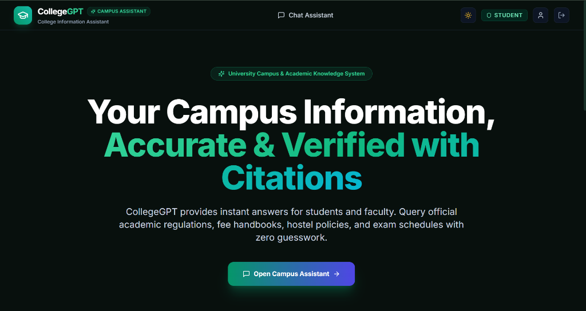
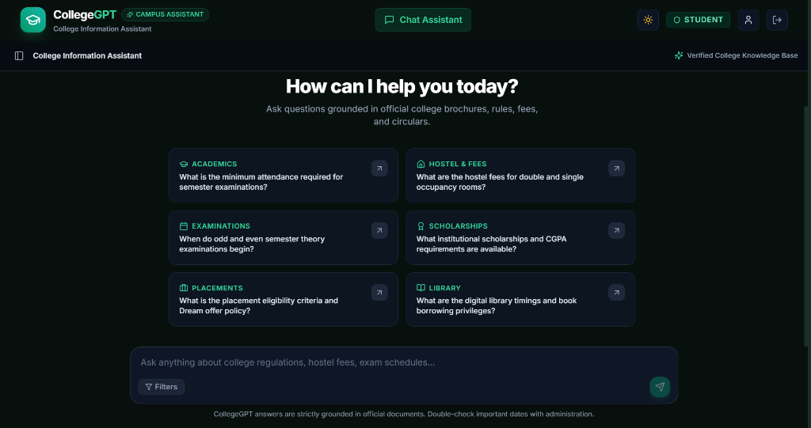
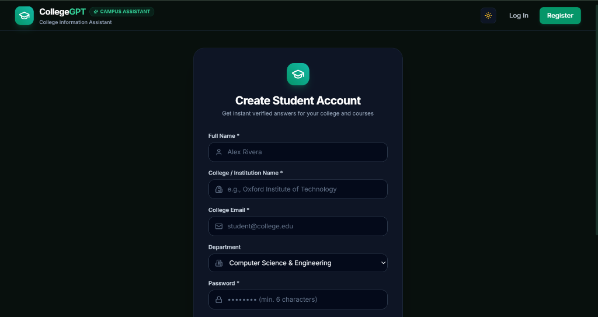
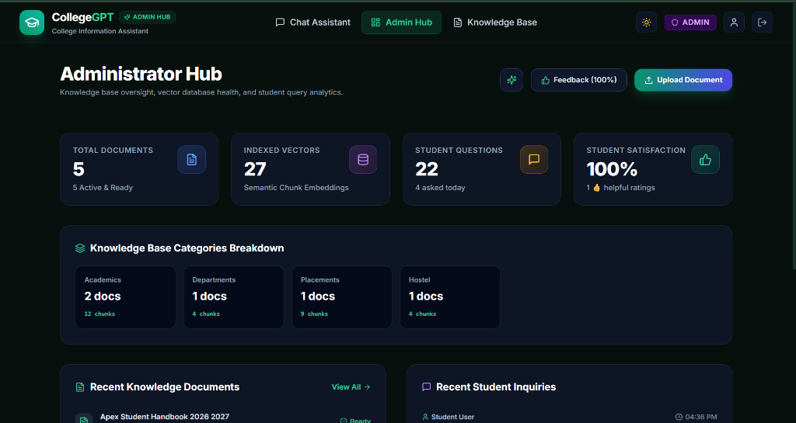
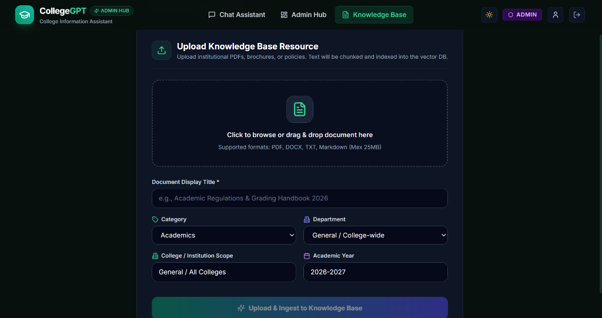

# 🎓 CollegeGPT — AI-Powered College Information Assistant with RAG


---

> [!TIP]
> ### 🔑 Default Admin & Student Credentials
> - **👑 Administrator Account**:
>   - **Email**: `admin@college.edu`
>   - **Password**: `Admin@12345`
>   - **Access**: Full Administrator Hub, Document Ingestion Manager, Chunk Inspector & Diagnostics
> - **🎓 Student Account**:
>   - **Email**: `student@college.edu`
>   - **Password**: `Student@12345`
>   - **Access**: Grounded RAG Chat Assistant, Verified Citations & Topic Discovery
>
> *(Or register a new student account with your own college name on the live site!)*

---

## 1. Project Name

**CollegeGPT** — An intelligent, grounded AI Campus Information Assistant built on **Retrieval-Augmented Generation (RAG)** for university regulations, fee structures, academic circulars, hostel guidelines, and placement policies.

---

## 2. Problem Statement

In universities and higher education institutions, vital information is scattered across dozens of lengthy PDF handbooks, physical notice boards, buried departmental websites, and outdated circulars. As a result:

- **Students** waste time searching through hundreds of pages or rely on inaccurate peer rumors regarding exam rules, fee deadlines, attendance policies, and hostel regulations.
- **Administrative staff** are inundated with repetitive inquiries that consume valuable office hours.
- **Generic AI chat tools** frequently hallucinate incorrect dates, policies, or fee amounts because they lack access to official institutional documents.

**CollegeGPT solves this problem** by providing a conversational AI assistant that retrieves facts **strictly from approved university publications**. Every answer is backed by exact source citations (document title, page number, category, and text excerpts), with a zero-hallucination policy that refuses to guess unverified information.

---

## 3. Features

### 🚀 Core Features

- **🔍 Hybrid Retrieval-Augmented Generation (RAG)**:
  - Dense vector semantic search combined with BM25 term frequency matching.
  - Title and category relevance boosting with dynamic query-length scoring thresholds.
- **📄 Multi-Format Institutional Document Ingestion**:
  - Supports **PDF**, **DOCX**, **TXT**, and **Markdown** uploads.
  - Automatic sliding-window chunking (800–1200 tokens) with contextual overlap.
- **🏛️ Multi-Tenant College Isolation**:
  - Students register with their specific **College / Institution Name**.
  - RAG searches partition and filter vectors to ensure students only retrieve information from their college's approved documents or institution-wide circulars.
- **🏷️ Grounded Answer Citations**:
  - Every response includes verifiable source cards displaying document title, page number, match confidence score, category, and exact excerpt snippets.
- **🛡️ Strict Anti-Hallucination Guardrails**:
  - System prompt constraints and minimum similarity thresholds prevent the AI from fabricating dates, fees, or policies.
  - When information is missing from the knowledge base, the system transparently advises contacting college administration.
- **💬 Conversational Session Management**:
  - Multi-turn conversation history with context persistence.
  - Dynamic conversation naming, sidebar search, and one-click chat creation/deletion.
- **👥 Role-Based Access Control (RBAC)**:
  - **Student Role**: Clean interface focused on queries, interactive citations, topic discovery cards, and 👍 / 👎 response feedback.
  - **Administrator Hub**: Centralized analytics dashboard, document ingestion manager, vector chunk inspector modal, and document reprocessing tools.

### ✨ Bonus & Polish Features

- **🌓 Dynamic Dual Theme Engine**:
  - **Dark Theme**: Modern Emerald & Mint Obsidian palette (`#08100D`).
  - **Light Theme**: Crisp, daylight-ready surface styling.
  - Automatically respects OS color preferences with instant localStorage persistence.
- **⚡ Zero-Config Offline Fallback Engine**:
  - Integrated local RAG vectorizer and disk-persisted vector store that works out-of-the-box even without external API keys.
- **📊 Real-Time AI & System Diagnostics**:
  - Administrative view displaying active LLM provider, embedding model, vector store count, database status, and query response latency in milliseconds.

---

## 4. Technology Stack

### Frontend
- **Core**: React 18 (Vite SPA)
- **Styling**: Vanilla CSS + Tailwind CSS (Custom Emerald & Mint Design System)
- **Icons**: Lucide React
- **Routing**: React Router v6
- **State & Context**: React Context API (`AuthContext`, `ThemeContext`, `ToastContext`)

### Backend
- **Runtime**: Node.js (v18+)
- **Server Framework**: Express.js
- **Authentication**: JSON Web Tokens (JWT) with HTTP Authorization headers & Bcrypt password hashing
- **File Ingestion**: Multer (Multipart uploads)
- **Document Parsers**: `pdf-parse` (PDF extraction), `mammoth` (Word .docx parsing)
- **Security & Utilities**: CORS, Morgan HTTP logger

### Database & Vector Storage
- **Primary Database**: MongoDB / MongoDB Atlas via Mongoose (with built-in in-memory fallback adapter)
- **Vector Store**: High-performance in-memory vector index with disk persistence & metadata filtering (Pinecone & Qdrant compatible)

### AI & LLM Services
- **LLM Providers**: Google Gemini (`gemini-1.5-flash`), OpenAI (`gpt-4o-mini`), Groq, or Local RAG Engine
- **Embedding Models**: Google `text-embedding-004`, OpenAI `text-embedding-3-small`, or Built-in 384-dimensional dense embedder

---

## 5. Screenshots

### 🏠 1. Home Page & Interactive Campus Directory
*Hero overview with institutional verification banner and instant student question starters.*



---

### 💬 2. Grounded Chat Assistant & Topic Inquiries
*Clean conversational interface with real-time prompt suggestions and department filters.*



---

### 📝 3. Student Registration with College Selection
*Multi-tenant student registration capturing student name, college/institution, department, and credentials.*



---

### 🛡️ 4. Administrator Hub & Knowledge Analytics
*Centralized management console tracking document processing status, chunk embeddings, and student satisfaction metrics.*



---

### 📤 5. Document Ingestion & Institutional Scope Tagging
*Drag-and-drop file uploader with category, department, and specific college scope tagging.*



---

## 6. Live Demo

- **Frontend Deployment (Vercel)**: [https://college-gpt-olive.vercel.app](https://college-gpt-olive.vercel.app)
- **Source Code (GitHub)**: [https://github.com/eswar-425/CollegeGPT](https://github.com/eswar-425/CollegeGPT)
- **Live Interactive Demo**: Access the web application at [https://college-gpt-olive.vercel.app](https://college-gpt-olive.vercel.app), sign in with the credentials below, or register a new student account with your college name.

### 🔑 Demo & Admin Credentials

| Role | Email | Password | Access Privileges |
| :--- | :--- | :--- | :--- |
| **👑 Administrator** | `admin@college.edu` | `Admin@12345` | Full access to Admin Hub, Document Ingestion, Semantic Chunk Inspector, Analytics & Diagnostics |
| **🎓 Student** | `student@college.edu` | `Student@12345` | Grounded RAG Chat Assistant, Verified Citations, Topic Starters & Response Feedback |

---

## 7. Backend

- **Deployed API Base URL (Render)**: [https://collegegpt-api.onrender.com](https://collegegpt-api.onrender.com)
- **Health Check & Service Status**: [https://collegegpt-api.onrender.com/api/health](https://collegegpt-api.onrender.com/api/health)

### 🏗️ Recommended Deployment Architecture

| Layer | Platform | Purpose | Link / Config |
| :--- | :--- | :--- | :--- |
| **Frontend Web App** | **Vercel** | SPA Hosting, Global Edge CDN, SSL, Continuous Deployment | [college-gpt-olive.vercel.app](https://college-gpt-olive.vercel.app) |
| **Backend API & RAG Engine** | **Render** | Node.js Web Service, Ingestion Pipeline, Vector Search | [collegegpt-api.onrender.com](https://collegegpt-api.onrender.com) |
| **Source Code & CI/CD** | **GitHub** | Version Control, Automated Deployments & Collaboration | [github.com/eswar-425/CollegeGPT](https://github.com/eswar-425/CollegeGPT) |
| **Database (Optional)** | **MongoDB Atlas** | Cloud NoSQL DB for document chunk metadata & users | Cloud Cluster |

---

## 8. Setup Instructions

### Prerequisites
- **Node.js**: v18.0.0 or higher ([Download Node.js](https://nodejs.org/))
- **npm** (v9+) or **yarn** / **pnpm**
- *(Optional)* **MongoDB**: Local instance or MongoDB Atlas URI
- *(Optional)* **Google Gemini API Key**: Free key from [Google AI Studio](https://aistudio.google.com/)

---

### Quick Start (Single-Command Setup)

Run both Backend and Frontend concurrently from the root directory:

```bash
# 1. Install all dependencies across root, backend, and client
npm run install:all

# 2. Launch both backend API (Port 5000) and frontend (Port 5173)
npm run dev
```

---

### Manual Setup (Separate Terminals)

#### 🖥️ Backend Server Setup
```bash
cd server
npm install
cp .env.example .env
npm run dev
```
*The backend API will start on `http://localhost:5000` and automatically seed default sample documents into the knowledge base.*

#### 💻 Frontend Client Setup
```bash
cd client
npm install
npm run dev
```
*Open [http://localhost:5173](http://localhost:5173) in your web browser to access CollegeGPT.*

---

## 9. Environment Variables

The application utilizes the following environment variables. Place these in `server/.env`.

> [!WARNING]
> **Security Notice**: Never commit `.env` files, API keys, passwords, or authentication secrets to GitHub or public version control. The `.gitignore` file is configured to exclude all `.env` files automatically.

| Variable Name | Required | Default Value | Description |
| :--- | :---: | :--- | :--- |
| `PORT` | Optional | `5000` | Port on which the Express server listens. |
| `NODE_ENV` | Optional | `development` | Runtime mode (`development` or `production`). |
| `CLIENT_URL` | Optional | `http://localhost:5173` | Allowed origin for Cross-Origin Resource Sharing (CORS). |
| `MONGODB_URI` | Optional | `mongodb://localhost:27017/collegegpt` | MongoDB connection string (falls back to in-memory store if unreachable). |
| `JWT_SECRET` | **Required** | `collegegpt_super_secret` | Secret key used to sign and verify JWT authentication tokens. |
| `JWT_EXPIRES_IN` | Optional | `7d` | Lifespan of user authentication tokens. |
| `LLM_PROVIDER` | Optional | `gemini` | Primary AI provider (`gemini`, `openai`, `groq`, `openrouter`, or `local`). |
| `LLM_API_KEY` | Optional | `""` | API key for the chosen LLM provider. |
| `LLM_MODEL` | Optional | `gemini-1.5-flash` | Model identifier to query for grounded generations. |
| `EMBEDDING_PROVIDER` | Optional | `local` | Embedding generator (`gemini`, `openai`, or `local`). |
| `EMBEDDING_API_KEY` | Optional | `""` | API key for embedding generation (if using cloud embedder). |
| `VECTOR_STORE_TYPE` | Optional | `memory` | Vector database backend (`memory`, `pinecone`, `qdrant`, or `mongodb`). |
| `RAG_TOP_K` | Optional | `5` | Maximum number of context chunks retrieved per query. |
| `RAG_MIN_SCORE` | Optional | `0.10` | Dynamic similarity threshold to prevent hallucinations. |
| `CHUNK_SIZE` | Optional | `1000` | Target character length for document text chunks. |
| `CHUNK_OVERLAP` | Optional | `150` | Overlap character count between consecutive chunks. |
| `MAX_FILE_SIZE_MB` | Optional | `25` | Maximum allowed file upload size in megabytes. |

---

## 📜 License

This project is open-source and distributed under the **MIT License**.
